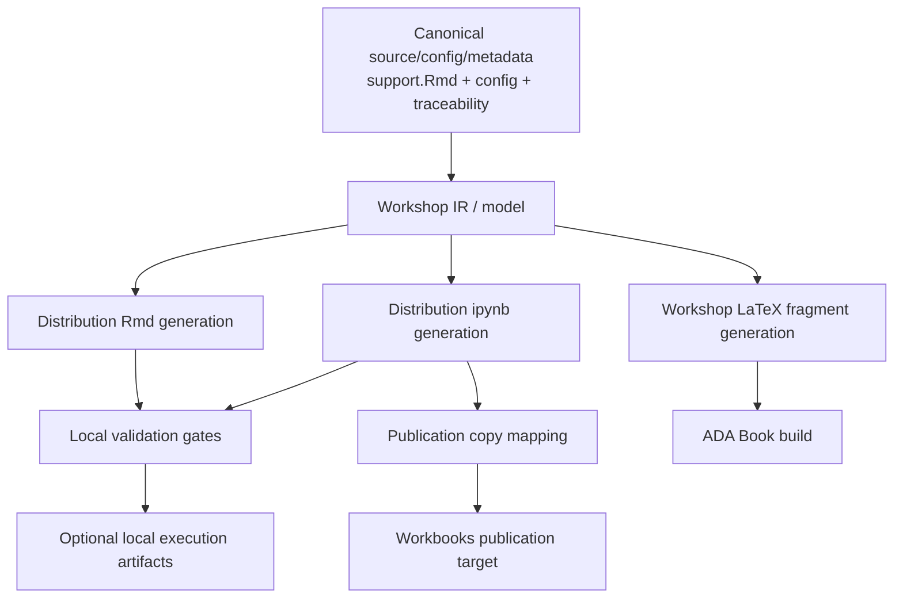
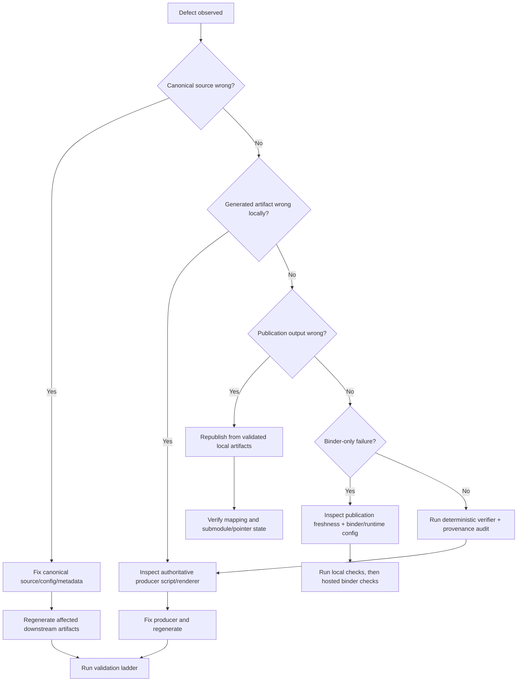

# Recovery and Regeneration Runbook

Date: 2026-07-13

## Scope

This runbook defines operational recovery and regeneration procedures for the canonical notebook generation, validation, book rendering, and publication architecture in this repository.

Recovery rule:

> Recovery restores downstream artifacts from the earliest intact authoritative layer; it never promotes a generated artifact to canonical source.

This runbook is local-first and does not require GitHub Actions or Binder for local recovery steps.

## Architecture Context and Source Documents

Operational context:

- `README.md`
- `docs/architecture/canonical-notebook-generation-conformance.md`
- `docs/architecture/generation-publication-permissions-audit.md`
- `docs/architecture/deterministic-notebook-generation.md`
- `docs/architecture/artifact-provenance-and-ownership.md`
- `docs/architecture/workshop-model-renderer-separation.md`
- `docs/architecture/binder-notebook-execution.md`

Note on path naming:

- `docs/canonical-notebook-generation.md` is not present in this repository.
- Use the architecture set above as the active source for recovery operations.

## Core Recovery Principles

- Canonical source layer is authoritative:
  - `notebooks/support/**/support.Rmd`
  - `metadata/workshop-registry.R` (loaded via `scripts/workshop-export-config.R`)
  - `metadata/traceability/*.yml`
- Generated artifacts are rebuildable and must not be repaired manually.
- Publication is synchronization of validated generated artifacts, not authoring.
- Deterministic rebuilds are expected for unchanged canonical inputs.

Legacy parser policy note:

- Legacy parser fallback is governed by
  `docs/architecture/legacy-parser-deprecation-policy.md`.
- During transition, fallback remains valid for recovery, but should not be
  treated as routine default operation.
- Current lifecycle stage is `Stage 1 — Preferred IR Default`.

## Phase 1: Recovery Surface Inventory

| Recovery surface | Authoritative upstream source | Authoritative producer | Canonical regeneration command | Expected output location | Validation command | Committed | Temporary | Published to another repo |
|---|---|---|---|---|---|---|---|---|
| Workshop IR snapshots | `notebooks/support/**/support.Rmd` + config | `scripts/workshop-ir.R` | `Rscript scripts/workshop-ir.R --input <support.Rmd> --output <ir.json>` | temp path or `generated/ir/` | `Rscript scripts/workshop-ir-validate.R --input <support.Rmd> --config-id <id>` | usually no | no | no |
| Generated student Rmd notebooks | support notebooks + `metadata/workshop-registry.R` | `scripts/export-workshops.R` | `Rscript scripts/export-workshops.R [--slug <slug>] [--output-dir <dir>]` | default `notebooks/workshops/*.Rmd` or chosen output dir | directive leakage checks via deterministic verifier; optional render smoke | yes (in submodule target) | no | yes (`workbooks`) |
| Generated distribution ipynb notebooks | support notebooks + workshop config + IR renderer | `scripts/export-python-notebooks.R` -> `scripts/workshop-ir-python-renderer.py` | `Rscript scripts/export-python-notebooks.R [--config-id <id>] --output-dir <dir>` | `generated/python-notebooks/**/chapter-*.ipynb` | `python3 scripts/ci/check-generated-python-notebooks.py --input-dir <dir>` | no | no | copied onward |
| Published Python notebook names/paths | generated ipynb staging | `scripts/publish-python-notebooks.R` | `Rscript scripts/publish-python-notebooks.R --input-dir <generated> --output-dir <target>` | `notebooks/workshops/Workshop <n> (Python).ipynb` | metadata/provenance validation is built into publish script | yes (submodule) | no | yes (`workbooks`) |
| Temporary executed Python notebooks | generated ipynb staging | `scripts/ci/execute-generated-python-notebooks.py` | `python3 scripts/ci/execute-generated-python-notebooks.py --input-dir <dir> --artifacts-dir <dir>` | `generated/notebook-execution-artifacts/executed/` | inspect `python-notebook-execution-report.json` | no | yes | no |
| Temporary executed R smoke outputs | generated/public R workshop notebooks | `scripts/ci/execute-r-workshop-smoke.R` | `Rscript scripts/ci/execute-r-workshop-smoke.R` | `generated/notebook-execution-artifacts/r-smoke/` | command exit + generated smoke markdown files | no | yes | no |
| Generated workshop LaTeX fragments | support notebooks + config (+ traceability metadata) | `scripts/export-workshop-output.R` | single: `Rscript scripts/export-workshop-output.R --input <support.Rmd> --output <exercise-*.tex>`; full: `export_workshop_by_config(...)` in R | `generated/workshop-output/exercise-*.tex` | deterministic verifier + TeX compilation checks | yes | no | no |
| Traceability reports | `metadata/traceability/*.yml` | `scripts/generate-traceability-reports.R`; quality gates in `scripts/ci/validate-parity-and-traceability.R` | `Rscript scripts/generate-traceability-reports.R --output-dir <dir>` | `generated/traceability/` | `Rscript scripts/ci/validate-parity-and-traceability.R ...` | mixed | no | no |
| Validation reports | generated notebooks + metadata | CI/local validation scripts | run validation scripts directly | `generated/traceability/`, `generated/notebook-execution-artifacts/` | script exit status and report contents | no | yes | no |
| Workbooks publication state | validated local generated notebooks | publication flow (`scripts/publish-python-notebooks.R`, CI sync in export workflow) | local staging publish command above; remote sync via repo workflow process | submodule `notebooks/workshops/` and remote `LuHoo/workbooks` | compare filenames, metadata and submodule pointer | yes | no | yes |
| Companion-site state | canonical site files and links | human-maintained site content in this repo | update canonical files directly | `index.html`, `contact.html`, docs links | local review and link checks | yes | no | yes |
| Binder-facing configuration | authoritative ADA `.binder/**` mirrored into `notebooks/workshops/.binder/**` | human-maintained config + binder readiness tooling | edit ADA root `.binder/**`, then mirror to workbooks boundary | `.binder/**`; `notebooks/workshops/.binder/**` | `bash scripts/ci/check-binder-config-drift.sh` + deferred hosted Binder checks | yes | no | yes |
| Submodule pointer state | parent git tree + submodule commit | git/submodule operations | `git submodule status`; pointer update via git commit | `.gitmodules`, gitlink entry for `notebooks/workshops` | `git submodule status` + `git status` | yes | no | yes |
| Final book outputs | canonical `.tex` + generated workshop fragments | LaTeX build command/task | task `Build Volume 1`/`Build Volume 2` or `latexmk ...` | root `*.pdf` | successful build, file timestamps, document review | no (ignored) | no | external distribution |

## Phase 2: Recovery Levels

### Level 1: Single-Artifact Regeneration

Use when one generated notebook/report/fragment is missing or stale.

Procedure:

1. Identify artifact class and producer from the matrix above.
2. Locate canonical upstream source (`support.Rmd`, config, metadata).
3. Regenerate smallest supported scope.

Examples:

- Single chapter Python notebook:
  - `Rscript scripts/export-python-notebooks.R --config-id probability-distributions --output-dir /tmp/ada-recovery-target/python-notebooks`
- Single LaTeX fragment:
  - `Rscript scripts/export-workshop-output.R --input notebooks/support/probability-distributions/support.Rmd --output /tmp/ada-recovery-target/workshop-output/exercise-1-1-1.tex`

4. Validate artifact-specific quality:

- Python notebook guardrail:
  - `python3 scripts/ci/check-generated-python-notebooks.py --input-dir /tmp/ada-recovery-target/python-notebooks`

When targeted regeneration is unsafe:

- when producer changed recently and touch scope is unknown;
- when parity/traceability or deterministic checks fail;
- when publication mapping may have drifted.

In those cases escalate to Level 2.

### Level 2: Full Local Regeneration

Use when broad drift is suspected.

Canonical order:

1. Regenerate distribution R notebooks.
2. Regenerate distribution Python notebooks.
3. Regenerate publication-ready Python naming/path copies (local staging target first).
4. Regenerate traceability reports.
5. Regenerate workshop LaTeX fragments.

Reference command sequence (safe temp targets):

```bash
Rscript scripts/export-workshops.R --output-dir /tmp/ada-recovery-full/r-workshops
Rscript scripts/export-python-notebooks.R --output-dir /tmp/ada-recovery-full/python-notebooks
Rscript scripts/publish-python-notebooks.R --input-dir /tmp/ada-recovery-full/python-notebooks --output-dir /tmp/ada-recovery-full/published-python-notebooks
Rscript scripts/generate-traceability-reports.R --output-dir /tmp/ada-recovery-full/traceability
Rscript -e "source('scripts/workshop-export-config.R', chdir = FALSE); source('scripts/export-workshop-output.R', chdir = FALSE); for (cfg in get_workshop_export_configs()) export_workshop_by_config(config = cfg, output_dir = '/tmp/ada-recovery-full/workshop-output', parser_engine = 'ir', enable_traceability = TRUE, traceability_strict = TRUE)"
```

Then run validation ladder (Phase 7).

### Level 3: Publication Resynchronization

Use when local generated artifacts are correct but publication targets are stale.

Procedure:

1. Run pre-publication checks locally:

- `python3 scripts/ci/check-generated-python-notebooks.py --input-dir generated/python-notebooks`
- deterministic checker:
  - `bash scripts/ci/verify-deterministic-notebook-generation.sh`

2. Publish to local staging target first:

- `Rscript scripts/publish-python-notebooks.R --input-dir generated/python-notebooks --output-dir /tmp/ada-recovery-publish-check`

3. Verify mapping and semantics:

- filenames must be `Workshop <n> (Python).ipynb`;
- publish script must pass metadata provenance checks;
- no semantic transforms are allowed in publish step.

4. Only then synchronize to submodule/release process.

Rollback for incorrect publication:

- revert publication commit(s) in publication repository;
- regenerate from canonical source in this repository;
- republish from validated artifacts.

### Level 4: Environment or Pipeline Recovery

Use when tools/dependencies/workflow setup is damaged.

Required components:

- R (validated architecture docs use 4.3.1 in hosted workflows);
- Python (validated architecture docs use 3.10 in hosted workflows; local can use `.venv`);
- LaTeX toolchain (`latexmk`);
- project R/Python dependencies from scripts and `.binder` requirements;
- bridge dependencies (rpy2, FSaudit, aicpa) where execution/parity checks require them.

Procedure:

1. Verify interpreters and toolchain availability.
2. Reinstall dependencies (R packages + Python requirements) as needed.
3. Re-run quick checks:

- `Rscript tests/workshop-ir/run-tests.R`
- `.venv/bin/python tests/python-renderer/run-tests.py` (or `python3 ...` if no venv)

4. Distinguish environment defect vs source defect:

- if deterministic generation passes but execution/parity fails, likely environment/runtime;
- if deterministic generation fails, inspect source/config/renderer.

Hosted validation still required later:

- full GitHub Actions workflows;
- Binder launch smoke/readiness checks.

## Phase 3: Failure Scenario Runbooks

### A. Generated file was edited manually

1. Identify file class and producer using artifact matrix.
2. Discard manual generated-file edits (do not patch generated output).
3. Fix earliest canonical source or producer logic.
4. Regenerate affected scope (Level 1 or 2).
5. Run deterministic checker.
6. Republish where required.

### B. Generated files differ after unchanged-source rebuild

1. Run deterministic verifier:

- `bash scripts/ci/verify-deterministic-notebook-generation.sh`

2. Classify cause:

- volatile metadata leak;
- environment difference;
- unstable ordering;
- stale intermediates;
- real source/config change;
- renderer defect.

3. Fix earliest responsible layer and rerun.

### C. Student-facing Rmd and ipynb educational drift

Inspect, in order:

1. canonical `support.Rmd`;
2. language directives (`ADA:BEGIN/END/REQUIRES`);
3. IR parse output;
4. renderer behavior;
5. parity/traceability reports.

Never hand-edit generated notebooks to align educational content.

### D. Notebook executes locally but fails in Binder

Distinguish:

- stale published workbooks;
- dependency/version mismatch;
- binder target repository mismatch;
- working-directory assumptions;
- bridge/import/runtime differences;
- transient Binder infrastructure failures.

Local-first checks:

- regenerate + guardrails + local execution scripts.

Then defer hosted binder launch/readiness checks.

### E. Book output differs from student notebook

Inspect layer-by-layer:

1. notebook generation;
2. execution artifacts/validation;
3. notebook-to-LaTeX conversion path;
4. book-only surrounding prose;
5. stale generated workshop `.tex`;
6. legacy generation fallback usage.

### F. Published workbooks repository out of sync

1. Validate local source artifacts.
2. Verify publication mapping (`chapter-<n>.ipynb` -> `Workshop <n> (Python).ipynb`).
3. Verify submodule pointer state (`git submodule status`).
4. Republish safely from validated local artifacts.
5. Roll back bad publication via git revert in publication repo.

### G. Traceability/reference reports stale

1. Validate canonical metadata under `metadata/traceability/`.
2. Regenerate reports:

- `Rscript scripts/generate-traceability-reports.R --output-dir <dir>`

3. Run parity/traceability validator:

- `Rscript scripts/ci/validate-parity-and-traceability.R --notebooks-dir <dir> --metadata-dir metadata/traceability --chapters 1,2,3,4,5,6`

4. Re-evaluate after workshop structure changes.

### H. Script change causes broad breakage

1. Isolate responsible layer (parser, renderer, publish, execution, or reporting).
2. Compare against last known good revision.
3. Use deterministic verifier and provenance policy to locate first failing transformation.
4. Prefer reverting infrastructure change over patching generated outputs.
5. Preserve canonical educational content commits while rolling back infra/script changes.

### I. Canonical source deleted/corrupted

1. Restore from git history (branch/tag/PR history).
2. If needed, recover from backup.
3. Generated notebooks can assist forensic reconstruction only.
4. Generated artifacts must not be promoted to canonical source without deliberate review.

## Phase 4: Regeneration Dependency Graph

Implemented path:



Transitional/legacy paths:

- `scripts/export-workshops.R` still uses direct source parsing/stripping for R distribution generation (not fully IR-renderer unified).
- `scripts/export-probability-distributions-workshop.R` contains legacy fallback to `notebooks/python/workshop02_python.ipynb` for Python-to-TeX.

Planned/not yet fully implemented path:

- full enforced chain where book workshop rendering always derives from validated executed notebooks for all tracks.

## Phase 5: Command Reference

All commands run from repository root.

### Targeted workshop generation (quick)

- Command:
  - `Rscript scripts/export-python-notebooks.R --config-id probability-distributions --output-dir /tmp/ada-recovery-target/python-notebooks`
- Prerequisites: R + jsonlite + python renderer dependencies.
- Output: one chapter notebook under temp output dir.
- Modifies tracked files: no (temp output).
- Validate after run:
  - `python3 scripts/ci/check-generated-python-notebooks.py --input-dir /tmp/ada-recovery-target/python-notebooks`

### Full Rmd distribution generation (moderate)

- Command:
  - `Rscript scripts/export-workshops.R --output-dir /tmp/ada-recovery-full/r-workshops`
- Output: generated R workshop notebooks.
- Modifies tracked files: no (when output-dir is temp).
- Validate: deterministic checker or directive leakage checks.

### Full Python notebook generation (moderate)

- Command:
  - `Rscript scripts/export-python-notebooks.R --output-dir /tmp/ada-recovery-full/python-notebooks`
- Output: chapter notebooks for all configured workshops.
- Modifies tracked files: no (temp output).
- Validate:
  - `python3 scripts/ci/check-generated-python-notebooks.py --input-dir /tmp/ada-recovery-full/python-notebooks`

### Deterministic-generation verification (expensive)

- Command:
  - `bash scripts/ci/verify-deterministic-notebook-generation.sh`
- Output: temporary dual-run roots in `/tmp` (cleaned unless `--keep-temp`).
- Modifies tracked files: no.
- Follow-up: inspect pass/fail diagnostics.

### IR tests (quick)

- Command:
  - `Rscript tests/workshop-ir/run-tests.R`
- Output: test diagnostics only.
- Modifies tracked files: no.

### Python renderer tests (quick/moderate)

- Command:
  - `.venv/bin/python tests/python-renderer/run-tests.py`
- Output: unittest diagnostics.
- Modifies tracked files: no.

### Local notebook validation gate (expensive)

- Command:
  - `.venv/bin/python scripts/ci/run-local-validation.py`
  - Compatibility wrapper: `bash scripts/ci/local-notebook-validation-gate.sh`
- Output: generated notebooks, execution artifacts, and `generated/validation/local-validation-report.json`.
- Modifies tracked files: yes under generated paths.
- Follow-up: deterministic checker and status review.

### Traceability report generation (quick)

- Command:
  - `Rscript scripts/generate-traceability-reports.R --output-dir /tmp/ada-recovery-full/traceability`
- Output: CSV/Markdown reports.
- Modifies tracked files: no when temp output is used.

### Workshop LaTeX generation (quick targeted / moderate full)

- Targeted command:
  - `Rscript scripts/export-workshop-output.R --input notebooks/support/probability-distributions/support.Rmd --output /tmp/ada-recovery-target/workshop-output/exercise-1-1-1.tex`
- Full command pattern: `export_workshop_by_config(...)` loop in R.
- Modifies tracked files: no when temp output is used.

### Book compilation (expensive)

- Tasks:
  - `Build Volume 1`
  - `Build Volume 2`
- Command equivalent:
  - `/Library/TeX/texbin/latexmk -pdf -interaction=nonstopmode -synctex=1 -file-line-error ada_volume1.tex`
- Output: PDF and LaTeX build artifacts.
- Modifies tracked files: auxiliary files in root.

### Publication preparation (moderate)

- Command:
  - `Rscript scripts/publish-python-notebooks.R --input-dir generated/python-notebooks --output-dir /tmp/ada-recovery-publish-check`
- Output: publication-mapped notebook filenames.
- Modifies tracked files: no if output-dir is temp.

### Repository/submodule status checks (quick)

- Commands:
  - `git status --short`
  - `git submodule status`
  - `git submodule foreach 'git status --short'`

## Phase 6: Safe Cleanup and Rebuild Boundaries

Classification:

- Safe to delete (temporary):
  - `generated/notebook-execution-artifacts/`
  - temporary recovery outputs under `/tmp/ada-recovery-*`
- Generated but committed (do not bulk delete blindly):
  - `generated/workshop-output/`
  - selected files under `generated/traceability/`
- Generated staging (safe to regenerate, often ignored):
  - `generated/python-notebooks/`
- Canonical content (must never delete in cleanup):
  - `notebooks/support/**`
  - `scripts/**`
  - `metadata/traceability/**`
  - canonical `.tex` source files
- Other repository boundary (do not delete as cleanup):
  - `notebooks/workshops` (submodule checkout)

Safe cleanup pattern:

1. Inspect first:

- `git status --short`
- `git submodule status`

2. Remove only temporary artifacts:

```bash
rm -rf generated/notebook-execution-artifacts /tmp/ada-recovery-target /tmp/ada-recovery-full /tmp/ada-recovery-publish-check
```

3. Re-check:

- `git status --short`

Avoid broad destructive cleanup commands over mixed canonical/generated trees.

## Phase 7: Post-Recovery Validation Ladder

1. Repository state:
   - `git status --short`
   - `git submodule status`
2. Source/schema validation:
   - `Rscript tests/workshop-ir/run-tests.R`
3. Deterministic generation:
   - `bash scripts/ci/verify-deterministic-notebook-generation.sh`
4. Leakage guardrails:
   - included in deterministic checker
5. Notebook structural checks:
   - `python3 scripts/ci/check-generated-python-notebooks.py --input-dir generated/python-notebooks`
6. Local execution checks:
   - `Rscript scripts/ci/execute-r-workshop-smoke.R`
   - `python3 scripts/ci/execute-generated-python-notebooks.py --input-dir generated/python-notebooks --artifacts-dir generated/notebook-execution-artifacts --timeout 600`
7. Parity/traceability checks:
   - `Rscript scripts/ci/validate-parity-and-traceability.R --chapters 1,2,3,4,5,6 --notebooks-dir generated/python-notebooks --metadata-dir metadata/traceability --output-json generated/traceability/parity-report.json --output-summary generated/traceability/parity-report.txt`
8. LaTeX/book checks:
   - regenerate workshop LaTeX fragments
   - build volume tasks
9. Publication-diff review:
   - publish to temp mapping target and compare
10. Hosted validation when available:
   - GitHub Actions workflows
   - Binder readiness/launch checks

Local evidence available now:

- deterministic checker;
- IR tests;
- renderer tests;
- targeted and full regeneration to temporary locations.

Deferred hosted evidence:

- GitHub Actions publication and execution matrix;
- Binder launch/readiness checks.

## Phase 8: Rollback Procedures

Rollback is separate from regeneration.

### Revert renderer/orchestrator change

1. Inspect candidate commits (`git log`, `git show`).
2. Revert with git (non-destructive, auditable).
3. Regenerate downstream artifacts from canonical source.
4. Run validation ladder.

### Revert publication commit

1. In publication repository, identify wrong publication commit.
2. Revert commit.
3. Regenerate and republish from validated local source artifacts.

### Reset submodule pointer safely

1. Inspect current and target submodule SHAs.
2. Update pointer via normal git commit in parent repo.
3. Validate `git submodule status` and publication mappings.

Warnings:

- Do not use destructive git commands without explicit review.
- Always inspect affected files before rollback.
- Avoid mixed states (new source + old generated outputs) by regenerating after rollback.

Legacy parser fallback warning:

- If rollback uses `--parser-engine legacy`, record rationale in the associated
  issue/PR/release notes and re-evaluate advancement criteria at the next
  deprecation checkpoint.
- Rollback remains supported during transition, but retirement of rollback
  support requires a separate future removal issue and PR.

## Phase 9: Recovery Decision Tree



## Phase 10: Documentation Integration

This runbook links to:

- canonical/conformance context:
  - `docs/architecture/canonical-notebook-generation-conformance.md`
- legacy parser lifecycle governance:
  - `docs/architecture/legacy-parser-deprecation-policy.md`
- permissions/publication boundaries:
  - `docs/architecture/generation-publication-permissions-audit.md`
- deterministic generation contract:
  - `docs/architecture/deterministic-notebook-generation.md`
- artifact provenance and ownership:
  - `docs/architecture/artifact-provenance-and-ownership.md`
- model/renderer separation:
  - `docs/architecture/workshop-model-renderer-separation.md`
- binder execution architecture:
  - `docs/architecture/binder-notebook-execution.md`
- traceability process:
  - `docs/traceability/contributor-workflow.md`

## Acceptance Checklist

- [x] Authoritative source and producer mapping is documented per artifact class.
- [x] Targeted and full regeneration procedures are documented.
- [x] Publication resynchronization is documented.
- [x] Environment recovery is documented.
- [x] Safe cleanup boundaries are documented.
- [x] Post-recovery validation ladder is documented.
- [x] Rollback procedures are documented.
- [x] Failure scenarios include repository-grounded commands.
- [x] Implemented vs transitional paths are explicitly labeled.
- [x] No recovery procedure requires manual generated-file editing.
- [x] Local procedures do not require GitHub Actions or Binder.
- [x] Deferred hosted validation needs are explicitly documented.
