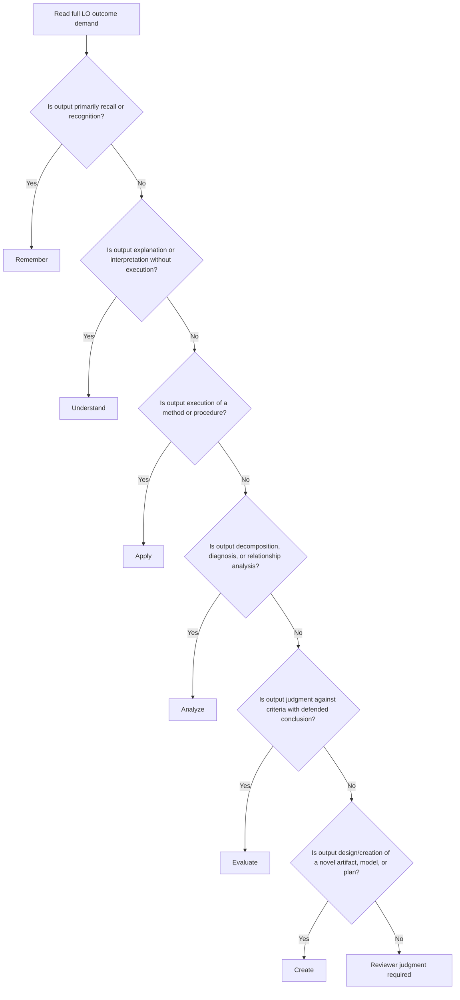
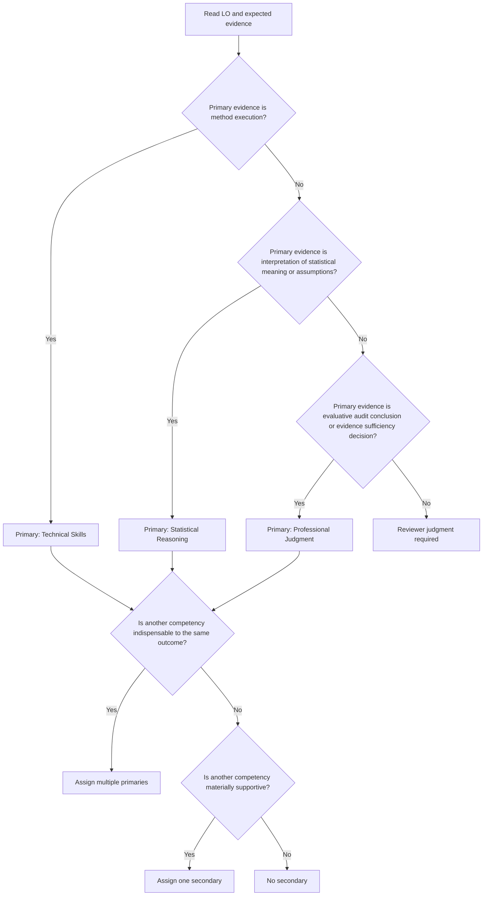

# Learning Objective Authoring Standard

Status: Normative Standard (Authoritative)
Version: 1.0.0
Effective date: 2026-08-01
Applies to: Audit Data Analysis curriculum (all volumes)
Normative language: MUST, MUST NOT, SHOULD, MAY are used as defined in RFC 2119-style usage.

## 0. Purpose and Authority

This standard defines the canonical rules for learning-objective (LO) authoring, classification, review, and validation across the Audit Data Analysis curriculum.

This document is authoritative for:

- LO authoring and rewrite decisions;
- curriculum governance and quality review;
- future automated validation;
- LO traceability and coverage analysis;
- Bloom and competency classification.

Where this standard conflicts with prior LO conventions, this standard prevails.

## 0.1 Normative Scope Decision

LO scope is chapter-only.

- LOs MUST exist only at chapter level.
- LOs MUST NOT be authored at section level.
- LOs MUST NOT be authored at workshop level.
- Exercises, workshops, case studies, and review questions MUST map to chapter-level LOs.

Implication: any legacy section-level LO records are migration candidates and are not compliant in their current form.

## 0.2 Fixed Competency Model

The competency model is fixed to three categories:

1. Technical Skills
2. Statistical Reasoning
3. Professional Judgment

Additional competency categories MUST NOT be introduced in LO metadata without formal governance change.

For Volume 2, Audit Judgment MUST be treated as a specialized expression of Professional Judgment and MUST NOT be modeled as a fourth LO competency category.

## 0.3 Assumptions and Evidence Gaps

The following assumptions are adopted for immediate governance continuity:

- Existing LO metadata contains legacy mixed-scope records (chapter and section).
- Existing LO text quality is uneven and includes authoring defects (for example: activity statements, compound outcomes, and verb-level Bloom mismatches).
- Some existing decisions and documents still describe section-level modeling and a four-competency framing in Volume 2.

These assumptions are explicit because repository evidence is internally inconsistent. This standard resolves those inconsistencies normatively.

## 1. Design Principles

### 1.1 Curriculum Alignment

- Every LO MUST define an intended student capability that aligns to chapter purpose.
- Every chapter MUST have an LO set that reflects the chapter's substantive educational goals, not its table-of-contents headings.

### 1.2 Traceability

- Every LO MUST be traceable to instructional and/or assessment artifacts.
- Traceability links MUST be explicit and identifier-based.
- Missing links MUST be treated as validation exceptions and reviewed.

### 1.3 Consistency

- LO structure and metadata fields MUST be consistent across chapters.
- Equivalent capability statements SHOULD follow comparable syntax and abstraction level.

### 1.4 Assessability

- Each LO MUST be assessable through observable evidence of performance, interpretation, or judgment.
- Non-observable intentions (for example: appreciate, become aware of) MUST NOT be accepted as compliant LOs.

### 1.5 Maintainability

- LO records MUST be author-editable and diff-friendly.
- LO IDs MUST remain stable and MUST NOT be repurposed.
- Rewording MUST preserve ID continuity unless the outcome itself is replaced.

### 1.6 Support for Automated Validation

- Every normative rule in this standard SHOULD be implementable in deterministic checks where feasible.
- Rules requiring expert judgment MUST still produce structured reviewer outcomes (pass/fail/needs-review with rationale).

## 2. Learning Objective Form Standard

## 2.1 Required Core Form

A conforming LO SHOULD contain:

- one primary observable cognitive action;
- one clear object of learning (knowledge object, skill object, or judgment object);
- optional context that narrows application conditions.

Canonical template:

Action + Object + Optional Context

Examples:

- Analyze residual diagnostics to assess model reliability for audit evidence.
- Evaluate whether identified anomalies require additional audit procedures.
- Construct a confidence interval for a population proportion using sample data.

## 2.2 Allowed Structure

A valid LO MAY include:

- one compound object if it is a single integrated outcome (for example: precision and uncertainty of an estimate);
- a bounded qualifier that clarifies context (for example: in an audit setting, given sample data, under stated assumptions);
- discipline-specific terminology if unambiguous.

## 2.3 Prohibited Structure

An LO MUST NOT be any of the following:

- activity statement: complete the workshop exercise on regression;
- teaching activity: discuss in class, review chapter content;
- content label: regression assumptions;
- multi-outcome list with independent testability;
- unrelated outcome bundle.

Invalid examples:

- Learn regression analysis and run diagnostics and discuss ethics.
- Understand Chapter 5.
- Perform stepwise regression, evaluate model fit, and write an audit memo.

## 2.4 Primary Action Identification Rule

To identify the primary action:

1. Identify all verbs that imply measurable cognitive performance.
2. Remove verbs that are framing-only (for example: understand, know) when another verb carries measurable demand.
3. Select the highest-demand verb that represents the central assessable outcome.
4. Rewrite the LO so the primary action appears first.

Example rewrite:

- Before: Understand and evaluate whether anomalies warrant further procedures.
- After: Evaluate whether anomalies warrant further audit procedures.

## 2.5 Compound Objective Handling Rule

If an LO contains multiple actions, apply this test:

- If all actions are required steps of one integrated outcome, keep one LO and rewrite to a single primary action.
- If actions are independently assessable outcomes, split into separate LOs.

Example:

- Invalid: Calculate confidence intervals and evaluate sufficiency of audit evidence.
- Split into:
  - Construct confidence intervals for key parameters.
  - Evaluate whether resulting evidence is sufficient for the audit conclusion.

## 2.6 Context Handling Rule

Context is optional and MUST be subordinate to the action-object core.

- Context SHOULD appear after the object.
- Context MUST NOT introduce a second independent outcome.
- Context SHOULD be concise and necessary.

Example:

- Good: Evaluate model reliability using residual diagnostics and assumption checks.
- Bad: Evaluate model reliability and design a new sampling plan.

## 2.7 Object of Learning Identification Rule

The LO object MUST be explicit and singular at outcome level:

- knowledge object: assumptions underlying confidence intervals;
- skill object: confidence interval construction for proportions;
- judgment object: sufficiency of evidence for an audit conclusion.

If the object cannot be clearly identified, the LO fails LO-002.

## 2.8 Authoring Style Rules

- LOs SHOULD begin with an action verb whenever possible.
- LOs MUST place the primary observable cognitive action first.
- LOs SHOULD place context after core action and object.
- LOs SHOULD use consistent sentence structure across a chapter.
- LOs SHOULD avoid unnecessary conditions and quality criteria unless they are integral to the outcome.

## 3. Bloom Classification Standard

## 3.1 Required Classification

- Every LO MUST have a Bloom classification.
- Default cardinality is one Bloom level per LO.
- Multiple Bloom levels MAY be assigned only in exceptional, justified cases where one LO unavoidably spans two inseparable cognitive demands.

## 3.2 Bloom Levels

The allowed vocabulary is:

- Remember
- Understand
- Apply
- Analyze
- Evaluate
- Create

Normalized machine values SHOULD be:

- remember, understand, apply, analyze, evaluate, create

## 3.3 Classification Principle

Bloom level MUST be determined by actual cognitive demand of the completed task, not by the surface verb alone.

Examples of misleading verb usage:

- Explain may be Remember, Understand, or Analyze depending on required reasoning depth.
- Evaluate may be misused when the task is only identifying a definition.

## 3.4 Classification Decision Tree

## 3.5 Tie-Breaking Rules

When two levels appear plausible:

1. Select the level required by assessment evidence, not the introductory phrasing.
2. Prefer the highest level that is indispensable to demonstrate success.
3. If both levels are inseparable and both indispensable, assign two levels and document justification.
4. If separable, split the LO and assign one level per LO.

## 3.6 Worked Examples

- LO: Recall assumptions of simple random sampling.
  - Bloom: Remember
- LO: Explain why violating homoskedasticity affects interval validity.
  - Bloom: Understand
- LO: Compute a prediction interval for expected revenue.
  - Bloom: Apply
- LO: Diagnose whether residual patterns indicate model misspecification.
  - Bloom: Analyze
- LO: Judge whether evidence is sufficient to support an audit conclusion.
  - Bloom: Evaluate
- LO: Design an analysis plan that integrates sampling and analytical procedures.
  - Bloom: Create

## 3.7 Counterexamples

- LO: Evaluate the definition of p-value.
  - Likely incorrect Bloom assignment; demand is usually Remember or Understand.
- LO: Create a list of assumptions.
  - Verb suggests Create but demand is Remember.

## 4. Competency Classification Standard

## 4.1 Required Classification

- Every LO MUST include competency classification.
- One or more primary competencies MUST be assigned.
- Secondary competency MAY be assigned when it adds governance value.

## 4.2 Competency Definitions

Technical Skills:

- correct execution of methods, procedures, tools, and computational workflows.

Statistical Reasoning:

- interpretation of statistical meaning, assumptions, uncertainty, and limitations.

Professional Judgment:

- evaluative decisions about evidence sufficiency, audit implications, and defensible conclusions.

## 4.3 Primary vs Secondary Rules

Multiple primary competencies are appropriate only when:

- the outcome intrinsically requires integrated demonstration across competencies; and
- neither competency can be removed without changing LO meaning.

Secondary competency is appropriate when:

- one competency is clearly dominant for assessment;
- another competency is materially present but supportive rather than central.

Neither primary nor secondary omissions are acceptable:

- an LO without any primary competency fails validation.
- secondary competency is optional and MUST NOT be forced.

## 4.4 Competency Decision Tree

## 4.5 Examples

- Compute sampling interval estimates.
  - Primary: Technical Skills
- Interpret confidence interval width under different sample sizes.
  - Primary: Statistical Reasoning
- Evaluate whether remaining uncertainty requires additional procedures.
  - Primary: Professional Judgment
- Evaluate model reliability and interpret implications for evidence quality.
  - Primaries: Statistical Reasoning + Professional Judgment
- Construct a model and justify evidence sufficiency.
  - Primary: Technical Skills
  - Secondary: Professional Judgment

## 4.6 Borderline Cases

- Use regression diagnostics to judge reliability of evidence.
  - Usually dual-primary: Technical Skills + Professional Judgment, unless execution burden is trivial and interpretation/judgment dominates.
- Explain assumptions and decide whether model evidence is acceptable.
  - Likely primary Professional Judgment, secondary Statistical Reasoning, unless both are equally central in grading rubric.

## 5. Scope Standard

## 5.1 Scope Rules

- LO scope MUST be chapter.
- Section-level LOs MUST NOT be authored in new or revised records.
- Workshop-level objectives MUST NOT be created as independent LOs.
- Exercises MUST map to chapter-level LOs.

## 5.2 Traceability Architecture

Required relationship chain:

Learning Objective
    -> Chapter Content
    -> Workshop Exercises
    -> Case Studies
    -> Review Questions

Interpretation rule:

- The chain is a traceability architecture, not a strict one-to-one pipeline.
- Each LO SHOULD have evidence across the chain where pedagogically appropriate.

## 5.3 Traceability Requirements

- Every chapter-level LO MUST map to at least one instructional artifact (chapter content, workshop, or case).
- Most chapter-level LOs SHOULD map to at least one assessment artifact (review question and/or assessable workshop exercise).
- Traceability exceptions MAY exist but MUST be explicitly documented with rationale and review date.

## 5.4 Examples

- LO: Evaluate anomaly evidence sufficiency.
  - Chapter content: anomaly interpretation section.
  - Workshop exercises: anomaly diagnosis tasks.
  - Case study: anomaly follow-up decision memo.
  - Review question: decide whether additional procedures are required.

## 5.5 Assessment Guidance for Limitation-Bound Inference Objectives

For evidence tasks mapped to LO-C4-15 and LO-C4-16 (or equivalent objectives with the same demand), assessors MUST require explicit separation between:

- what the statistical evidence supports; and
- what the statistical evidence does not support.

Required evidence-task output elements:

1. conclusion statement tied to the stated misstatement threshold or inferential claim;
2. explicit limitations statement (unsupported claims and boundary conditions);
3. uncertainty rationale using confidence language and error-risk framing.

Assessment artifacts (rubrics, model answers, and review-question marking guides) MUST include separate scoring criteria for supported and unsupported conclusion statements.

A response that reports only a reject/fail-to-reject decision without explicit supported-vs-unsupported interpretation is non-compliant with assessability expectations for these objectives.

## 6. Granularity Standard

## 6.1 Granularity Objective

LOs MUST be broad enough to represent meaningful chapter outcomes and narrow enough to be teachable and assessable.

## 6.2 Too Broad Indicators

An LO is too broad if one or more are true:

- it spans multiple independent outcomes requiring separate rubrics;
- it cannot be reasonably assessed in one coherent assessment event;
- it restates chapter scope rather than a capability.

Example too broad:

- Apply all statistical methods in this chapter to any audit problem.

## 6.3 Too Narrow Indicators

An LO is too narrow if one or more are true:

- it captures a micro-step rather than an educationally meaningful capability;
- it is an isolated subprocedure that only exists as part of a larger routine;
- it creates unnecessary decomposition without governance value.

Example too narrow:

- Enter data into software and click run.

## 6.4 Appropriate Indicators

An LO is appropriately granular if:

- it has one assessable capability;
- it can be taught and evidenced within chapter-level design;
- it contributes meaningfully to professional performance.

## 6.5 Rewrite Patterns

- Broad to appropriate:
  - Before: Evaluate and perform sampling, estimation, and regression for audit conclusions.
  - After 1: Apply sampling and estimation procedures to generate statistical evidence.
  - After 2: Evaluate whether generated statistical evidence supports an audit conclusion.

- Narrow to appropriate:
  - Before: Compute the F statistic denominator.
  - After: Interpret ANOVA outputs to evaluate model usefulness for audit evidence.

## 6.6 Chapter Variability Rule

- Chapters MAY differ in LO count due to inherent topic complexity.
- Small foundational chapters MAY have fewer LOs.
- Methodologically dense chapters MAY have more LOs.
- LO count MUST NOT be normalized to an arbitrary fixed target.

## 7. Validation Rules

Each rule has a stable ID and is normative.

## 7.1 LO-001 Single Primary Action

Title: Single Primary Action
Description: LO contains one central observable cognitive action.
Pass criteria: one dominant assessable action is clear.
Fail criteria: multiple independent actions/outcomes in one LO.
Examples:

- Pass: Evaluate whether model diagnostics support evidence reliability.
- Fail: Calculate diagnostics, evaluate reliability, and write policy recommendations.

## 7.2 LO-002 Clear Learning Object

Title: Clear Learning Object
Description: LO states explicit object of learning.
Pass criteria: knowledge/skill/judgment object is unambiguous.
Fail criteria: object missing, vague, or broad label only.
Examples:

- Pass: Construct prediction intervals for revenue expectations.
- Fail: Understand regression.

## 7.3 LO-003 Assessability

Title: Assessability
Description: LO can be evidenced through observable performance or decision output.
Pass criteria: plausible assessment evidence can be defined.
Fail criteria: non-observable intent language.
Examples:

- Pass: Judge whether evidence suffices for conclusion.
- Fail: Appreciate the value of diagnostics.

## 7.4 LO-004 Bloom Classification Assigned

Title: Bloom Classification Assigned
Description: Every LO has Bloom level based on cognitive demand.
Pass criteria: valid Bloom value present; justification consistent with demand.
Fail criteria: missing/invalid value or verb-only misclassification.
Examples:

- Pass: Analyze residual patterns. Bloom: analyze.
- Fail: List assumptions. Bloom: create.

## 7.5 LO-005 Competency Classification Assigned

Title: Competency Classification Assigned
Description: Every LO has at least one primary competency from fixed model.
Pass criteria: primary competency set is valid and justified.
Fail criteria: missing primary, invalid category, unjustified over-classification.
Examples:

- Pass: Evaluate evidence sufficiency. Primary: Professional Judgment.
- Fail: Primary: Audit Decision-Making.

## 7.6 LO-006 Scope Compliance

Title: Scope Compliance
Description: LO uses chapter-only scope model.
Pass criteria: scope is chapter.
Fail criteria: scope is section or workshop.
Examples:

- Pass: chapter-level LO record.
- Fail: section-level LO-C5S5.3-01 in active compliance set.

## 7.7 LO-007 Granularity Compliance

Title: Granularity Compliance
Description: LO is neither too broad nor too narrow.
Pass criteria: one meaningful assessable capability at chapter outcome level.
Fail criteria: umbrella objective or micro-step objective.
Examples:

- Pass: Evaluate model reliability for audit use.
- Fail: Apply all chapter methods to all contexts.

## 7.8 LO-008 Activity-vs-Outcome Separation

Title: Activity-vs-Outcome Separation
Description: LO describes student outcome, not teacher/student activity.
Pass criteria: capability statement independent of delivery method.
Fail criteria: references activity as objective.
Examples:

- Pass: Interpret hypothesis-test outcomes for audit decisions.
- Fail: Complete workshop 5.2 and discuss in class.

## 7.9 LO-009 Traceability Link Presence

Title: Traceability Link Presence
Description: LO has explicit mapping to learning/assessment artifacts.
Pass criteria: at least one instructional trace exists; assessment trace exists or documented exception.
Fail criteria: no traceability links and no approved exception.
Examples:

- Pass: LO mapped to workshop and review question.
- Fail: LO exists only as text with no mapping.

## 7.10 LO-010 Metadata Conformance

Title: Metadata Conformance
Description: LO record satisfies required schema fields and controlled vocabularies.
Pass criteria: ID, chapter, scope, text, bloom, status, competency fields valid.
Fail criteria: malformed ID, invalid vocabulary, missing required field.
Examples:

- Pass: LO-C4-03 with valid chapter scope and taxonomy labels.
- Fail: LO-4-A with scope section and bloom critical-thinking.

## 7.11 LO-011 Stable Identifier Governance

Title: Stable Identifier Governance
Description: Existing IDs are never repurposed.
Pass criteria: wording updates preserve ID; retired outcomes marked retired.
Fail criteria: ID reassigned to new outcome meaning.
Examples:

- Pass: LO-C2-05 text refined, ID unchanged.
- Fail: LO-C2-05 reused for unrelated regression objective.

## 7.12 LO-012 Language and Form Consistency

Title: Language and Form Consistency
Description: LO follows standard authoring syntax and readability rules.
Pass criteria: action-first phrasing, concise structure, no unnecessary qualifiers.
Fail criteria: inconsistent structure, excessive conditions, ambiguous phrasing.
Examples:

- Pass: Evaluate whether interval precision supports required assurance.
- Fail: In light of many potential considerations, students might evaluate precision outcomes.

## 7.13 Automation Readiness Notes

Rules with high deterministic automation potential:

- LO-004, LO-005, LO-006, LO-010, LO-011.

Rules requiring hybrid human + rule support:

- LO-001, LO-002, LO-003, LO-007, LO-008, LO-012.

## 8. Migration Guidance

## 8.1 Migration Objective

Bring all legacy LOs into compliance without losing traceability continuity.

## 8.2 Common Defects

- section-level scope records in active set;
- multiple independent actions in one LO;
- activity-based statements;
- vague objects (for example: understand chapter);
- Bloom level assigned from verb only;
- missing or inconsistent competency assignments.

## 8.3 Rewrite Patterns

Pattern A: Activity to outcome

- Before: Complete workshop on hypothesis testing.
- After: Interpret hypothesis-test results to evaluate anomaly evidence.

Pattern B: Compound split

- Before: Compute intervals and evaluate evidence sufficiency.
- After 1: Construct confidence and prediction intervals.
- After 2: Evaluate whether interval uncertainty permits conclusion.

Pattern C: Verb inflation correction

- Before: Create a list of assumptions.
- After: Recall assumptions underlying the model.

Pattern D: Scope normalization

- Before: multiple section-level LOs for procedural micro-steps.
- After: consolidated chapter-level capability LOs with preserved mapping links.

## 8.4 Legacy Section-Level Handling

- Legacy section-level records MUST be reviewed and dispositioned as: merge, split-to-chapter, retire, or convert.
- Converted outcomes SHOULD retain historical trace links via mapping tables.
- Historical IDs MAY be retained as retired aliases in migration logs to preserve audit trail.

## 8.5 Normalization Rules

- Normalize capitalization and action-first phrasing.
- Normalize Bloom vocabulary to controlled values.
- Normalize competency vocabulary to fixed three-category model.
- Remove unnecessary pedagogical process language.

## 8.6 Migration Workflow

1. Extract current LO inventory and classify defects by rule ID.
2. Propose target chapter-level LO set per chapter.
3. Rewrite and classify each target LO (Bloom + competency).
4. Remap workshop, case, and review links.
5. Validate against LO-001 to LO-012.
6. Publish migration report with before/after counts and exceptions.

## 9. Governance

## 9.1 Ownership

- Standard owner MUST be designated as Curriculum Governance Owner.
- Chapter leads MUST own chapter-level LO compliance.
- QA/traceability maintainer MUST own validation tooling and exception registry.

## 9.2 Review Process

- Any LO change MUST include rule-based self-check against LO-001 to LO-012.
- Material LO set changes SHOULD include peer review by one curriculum and one assessment reviewer.
- Exceptions MUST be time-bounded, documented, and approved.

## 9.3 Change Control

- Changes to this standard MUST be proposed through curriculum decision governance.
- Backward-incompatible changes (for example: competency model, scope model, mandatory fields) MUST include migration plan and effective date.
- Minor clarifications MAY be released without schema migration if rule intent is unchanged.

## 9.4 Relationship to Curriculum Decision Register

A formal curriculum decision entry SHOULD be created to establish this standard as binding and to supersede inconsistent prior LO modeling assumptions.

Recommended decision content:

- decision: chapter-only LO scope, fixed three-competency model, normative validation rules;
- supersedes/qualifies: prior inferred mixed-scope LO practice;
- implementation note: legacy section-level objectives migrated under controlled plan.

## 10. Compliance Statement

A learning objective is compliant only when:

- authoring form conforms to Section 2;
- Bloom classification conforms to Section 3;
- competency classification conforms to Section 4;
- scope and traceability conform to Section 5;
- granularity conforms to Section 6;
- all applicable validation rules in Section 7 pass or have approved exceptions;
- governance controls in Section 9 are met.

Non-compliant LOs MUST be corrected before they are accepted into the canonical active curriculum set.
